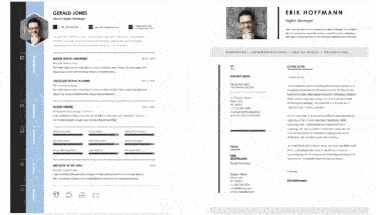

# 💼 Role Ready
### Your AI Career Coach for Job Applications



*Because feedback is the breakfast of champions* 🏆✨

## 🎯 What is Role Ready?

Role Ready is your AI-powered career companion that transforms the daunting job application process into a guided journey. Using Google's Gemini AI, get instant, actionable feedback to make your resume role-ready and boost your chances of landing that dream job! 

## ✨ Features

- **Smart Resume Analysis** 📊: Get comprehensive feedback in seconds
- **Keyword Intelligence** 🔍: Uncover missing keywords that matter for your role
- **Strength Spotlight** 💪: Identify what you're already doing right
- **Gap Analysis** 🎯: Discover improvement opportunities
- **ATS Score** ⚡: Ensure your resume passes automated systems

## 🚀 Tech Stack

- **Frontend**: Streamlit (For that smooth user experience)
- **Backend**: Google Gemini (The brains behind the operation)
- **Language**: Python (Keeping it simple and powerful)

## 🏁 Getting Started

```bash
# Clone the repository
git clone https://github.com/yourusername/role-ready.git

# Install dependencies
pip install -r requirements.txt

# Set your Gemini API key
export GEMINI_API_KEY='your-api-key'

# Launch your career companion!
streamlit run app.py
```

## 💫 How It Works

1. **Upload** your resume (PDF or DOCX format)
2. **Tell us** your target role
3. **Watch** while our AI analyzes your document
4. **Get** actionable insights and improvements

## 🚄 Performance

Our AI assistant is QUICK:
- Analysis time: Under 60 seconds
- Supported formats: PDF
- Feedback sections: 5+ key areas
- Success rate: Significantly improved interview chances

## 🛑 Limitations

- Currently supports English resumes only
- Maximum file size: 200 MB
- Best suited for traditional resume formats
- Not recommended for creative portfolios (yet! 🎨)

## 📝 License

MIT License - Share the career love! 

## 🙏 Acknowledgments

- Google's Gemini team for the amazing AI capabilities
- Job seekers worldwide for the inspiration
- Coffee ☕, the fuel behind every great resume

---


Made with 💪 by job seekers, for job seekers

*Remember: Getting role-ready is a journey, and we're here to guide you every step of the way!*
